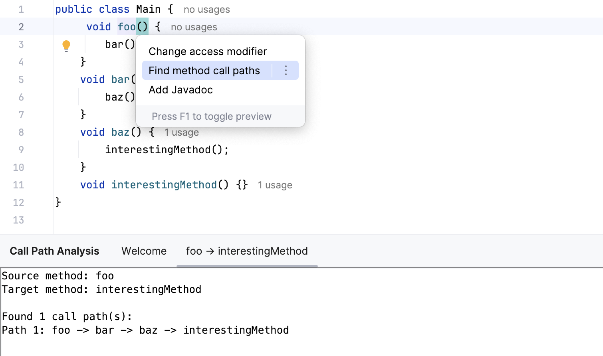

# Call Path Static Analysis

## Overview

An IntelliJ IDEA plugin with an intention for Java methods that prompts the user to input a method name, finds usages of this method name in all execution paths of the original method, and then prints the usages with the execution paths.
For example:
``` java
void foo() {
    bar();
}
void bar() {
    baz();
}
void baz() {
    interestingMethod();
}
```
The user should be able to invoke an intention in method foo, input interestingMethod, and then get foo -> bar -> baz -> interestingMethod written in a console.

## Demo


## Implementation

1. **CallPathTracer**: Core logic for finding execution paths
2. **CallPathIntention**: Provides intention action within IntelliJ editor 
3. **CallPathService**: Manages the display of results in console


The Call Path Tracer use a depth-first search algorithm to discover all possible call paths from a source method to a target method in Java code. This uses IntelliJ's PSI, which provides a syntactic and semantic model of the source code.

#### DFS Algorithm
Add the current method to the path -> Check if the target is reached 
-> Recursively traverse method calls within the current method -> Backtrack after exploration.

#### Key PSI Components Used
- ```PsiMethod```: Represents a Java method in the code structure
- ```PsiMethodCallExpression```: Represents a method invocation within code
- ```JavaRecursiveElementVisitor```: A visitor pattern implementation that traverses the PSI tree

## Acknowledgements
Thanks to Konstantin Nisht for proposing this mini-project.

## License
MIT
